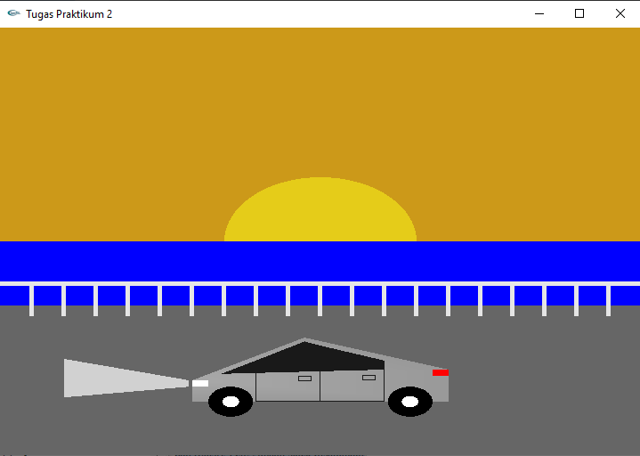

# 🚗 OpenGL 2D Cybertruck Simulation  

## 📌 Description  
This project is a **2D Tesla Cybertruck simulation** built using **OpenGL (GLUT)**.  

It demonstrates **basic transformations** like:
- 🏗 **Primitive Shapes** (Polygons, Circles, Rectangles)  
- 🎨 **Color Blending & Transparency**  
- 🔄 **Transformation (Translation & Rotation)**  
- 📚 **Matrix Stack Usage (`glPushMatrix()` & `glPopMatrix()`)**  

## 🛠 Features  
🌅 **Sunset-Themed Background**  
✅ **Object Transformations without affecting others**  

## ✨ Author
👨‍💻 **Akmal Fauzan Azima**  
📅 **Date: March 3, 2025**
